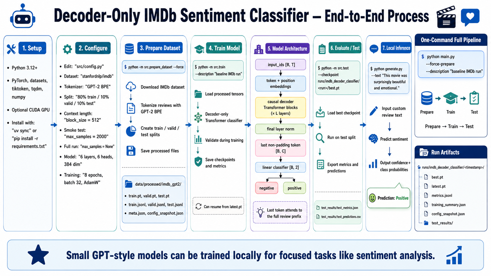

# Decoder-Only IMDb Sentiment Classifier

This project trains a small GPT-style causal decoder Transformer for binary
sentiment classification on IMDb movie reviews. It uses GPT-2 BPE tokenization,
pools the last non-padding token, and predicts `negative` or `positive` with a
linear classification head.



## Project Layout

```text
.
|-- main.py                  # end-to-end prepare -> train -> test pipeline
|-- generate.py              # sentiment inference for custom text
|-- src/
|   |-- config.py            # dataset, model, and training configuration
|   |-- prepare_dataset.py   # downloads/tokenizes IMDb and writes tensor splits
|   |-- create_model.py      # decoder-only Transformer classifier
|   |-- train.py             # training loop, validation, checkpoints, metrics
|   `-- test.py              # test-set evaluation and prediction export
|-- pyproject.toml           # uv/project dependencies
|-- uv.lock                  # locked dependency versions
`-- requirements.txt         # pip fallback dependencies
```

Generated data and training artifacts are ignored by git:

- `data/processed/imdb_gpt2/`
- `runs/imdb_decoder_classifier/`

## Requirements

- Python 3.12.11 or newer
- PyTorch
- `datasets`, `tiktoken`, `tqdm`, and `numpy`
- A CUDA GPU is optional. The code falls back to CPU when
  `CFG.train.device == "auto"`.

## Setup

Using `uv` with the checked-in lockfile:

```bash
uv sync
```

Or with plain `venv` and `pip`:

```bash
python3 -m venv .venv
source .venv/bin/activate
pip install -r requirements.txt
```

Run commands from the repository root. If you use `uv`, prefix commands with
`uv run`; if you activated `.venv`, use `python`.

## Configuration

Edit `src/config.py` before running experiments.

Useful defaults and knobs:

- Dataset: `stanfordnlp/imdb`
- Tokenizer: GPT-2 BPE through `tiktoken`
- Split: 80% train, 10% validation, 10% test after combining IMDb train/test
- Context length: `data.block_size = 512`
- Smoke-test size: set `data.max_samples` to a small integer such as `2000`
- Full dataset: set `data.max_samples = None`
- Model size: `6` layers, `6` heads, `384` embedding size
- Training: `8` epochs, batch size `32`, AdamW, optional CUDA mixed precision

The app config validates split percentages and model shape on import.

## End-to-End Run

Prepare the dataset, train, and test the best checkpoint:

```bash
python main.py --force-prepare --description "baseline IMDb run"
```

With `uv`:

```bash
uv run python main.py --force-prepare --description "baseline IMDb run"
```

`--force-prepare` rebuilds the tokenized dataset even when processed files
already exist. Omit it to reuse existing files in `data/processed/imdb_gpt2/`.

## Step-by-Step Workflow

Prepare the dataset:

```bash
python -m src.prepare_dataset --force
```

Train a new run:

```bash
python -m src.train --description "baseline IMDb run"
```

Resume from a checkpoint:

```bash
python -m src.train --resume-from runs/imdb_decoder_classifier/<run>/latest.pt
```

Evaluate a checkpoint on the test split:

```bash
python -m src.test --checkpoint runs/imdb_decoder_classifier/<run>/best.pt
```

If `--checkpoint` is omitted, `src.test` uses the most recently modified
`best.pt` under `runs/imdb_decoder_classifier/`.

## Inference

Classify custom text with the latest `best.pt` checkpoint:

```bash
python generate.py --text "This movie was surprisingly beautiful and emotional."
```

Use a specific checkpoint:

```bash
python generate.py \
  --checkpoint runs/imdb_decoder_classifier/<run>/best.pt \
  --text "The pacing was dull and the ending felt lazy."
```

The script prints the predicted sentiment, confidence, and class probabilities.

## Outputs

Dataset preparation writes:

```text
data/processed/imdb_gpt2/
|-- train.pt
|-- valid.pt
|-- test.pt
|-- train.jsonl
|-- valid.jsonl
|-- test.jsonl
|-- meta.json
`-- config_snapshot.json
```

Each training run creates a timestamped directory:

```text
runs/imdb_decoder_classifier/
`-- HH_MM_DD_MM_YYYY/
    |-- best.pt
    |-- latest.pt
    |-- metrics.jsonl
    |-- training_summary.json
    |-- config_snapshot.json
    `-- test_results/
        |-- test_metrics.json
        `-- test_predictions.csv
```

If multiple runs start in the same minute, the trainer appends a numeric suffix
to keep run directories unique.

## Architecture

```text
input_ids [B, T]
  -> token embedding + position embedding
  -> causal decoder Transformer blocks
  -> final layer norm
  -> hidden state at last non-padding token [B, C]
  -> linear classifier [B, 2]
```

The model pools the last useful token because causal attention lets that token
attend to the full review prefix. Padding uses GPT-2's end-of-text token because
GPT-2 BPE has no native pad token.

## Notes

- `generate.py` performs classification despite its name. The name is kept to
  match the project workflow.
- The Hugging Face IMDb dataset is downloaded during dataset preparation, so the
  first run needs network access.
- `training_summary.json` stores the free-text `--description`; the run folder
  name stays timestamp-based.
